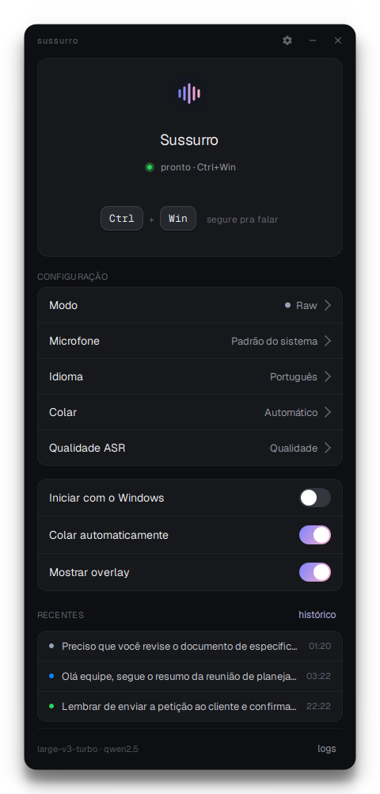
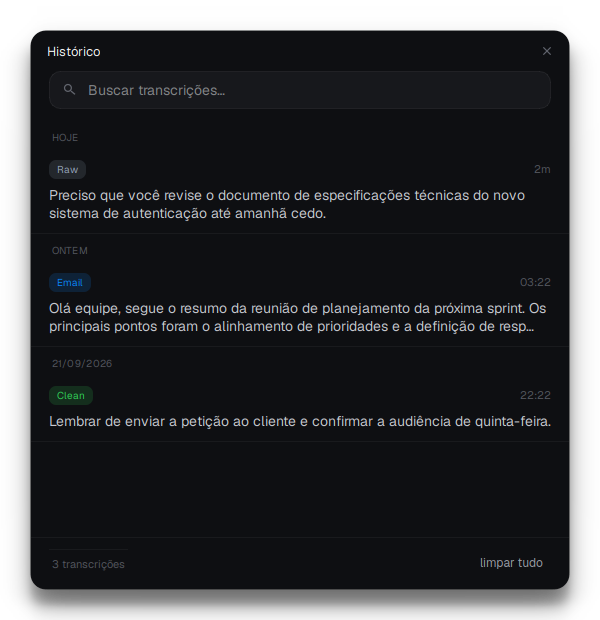
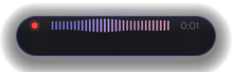
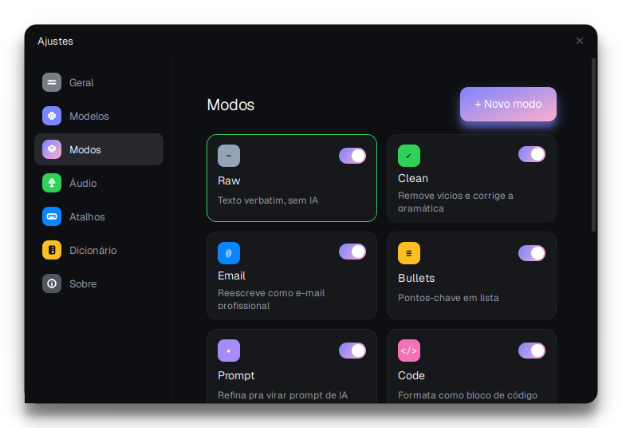

<div align="center">


# Sussurro

**Ditado por voz local e privado para Windows.**<br>
Segure um atalho, fale e solte: o texto aparece no aplicativo em foco.

[](https://github.com/Daniellpego/Sussurro/actions/workflows/ci.yml)
[](https://github.com/Daniellpego/Sussurro/releases/latest)
[](https://github.com/Daniellpego/Sussurro/releases)
[](LICENSE)

[Baixar](https://github.com/Daniellpego/Sussurro/releases/latest) ·
[Como usar](#como-usar) ·
[Recursos](#recursos) ·
[Desenvolvimento](#desenvolvimento) ·
[English](README.en.md)

<br>


&nbsp;&nbsp;


</div>

## Por que o Sussurro

- **Nada sai do seu computador.** Áudio, transcrições e histórico ficam na máquina. Não há conta, assinatura nem serviço de transcrição na nuvem.
- **Funciona em qualquer aplicativo.** O texto é colado na janela ativa e a área de transferência é restaurada depois.
- **Feito para o português do Brasil.** Pontuação falada, dicionário pessoal e macros para siglas ditas por extenso, como “esse tê efe” → STF e “ce pê éfe” → CPF.
- **Revisão com IA local, se você quiser.** Modos que limpam, formalizam, resumem ou traduzem o texto rodam no Ollama, também no seu computador.

## Instalação

Baixe o instalador na página da [versão mais recente](https://github.com/Daniellpego/Sussurro/releases/latest):

| Instalador | Para quem |
|---|---|
| `SussurroSetup-CPU.exe` | Qualquer computador, sem precisar de placa de vídeo |
| `SussurroSetup-CUDA.exe` | Computadores com GPU NVIDIA, para transcrever mais rápido |

Na primeira execução, o Sussurro baixa o modelo de transcrição e, se você quiser, instala o Ollama e o modelo de revisão. Depois disso, tudo funciona sem internet.

<details>
<summary><b>Conferir o instalador e o aviso do SmartScreen</b></summary>

<br>

Cada versão publica o arquivo `checksums-sha256.txt`. No PowerShell:

```powershell
Get-FileHash .\SussurroSetup-CPU.exe -Algorithm SHA256
```

Compare o resultado com a linha correspondente do arquivo de checksums.

Os instaladores ainda não são assinados digitalmente, então o Windows pode mostrar “O Windows protegeu o computador”. Se o checksum conferir, clique em **Mais informações** e depois em **Executar assim mesmo**. Os instaladores são gerados pelo workflow público [`release.yml`](.github/workflows/release.yml).

</details>

## Como usar

1. Abra o Sussurro. Ele fica na bandeja do sistema.
2. Segure <kbd>Ctrl</kbd> + <kbd>Win</kbd> enquanto fala. Um botão lateral do mouse também pode ser usado.
3. Solte as teclas. O texto é transcrito e colado onde o cursor estiver.

<p align="center">
  
  &nbsp;
  
</p>

### Comandos de voz

Fale o comando no meio do ditado:

| Você diz | Resultado |
|---|---|
| “vírgula”, “ponto final”, “dois pontos”, “ponto e vírgula” | `,` `.` `:` `;` |
| “ponto de interrogação”, “ponto de exclamação”, “reticências” | `?` `!` `…` |
| “nova linha”, “novo parágrafo” | quebra de linha ou de parágrafo |
| “abre aspas” … “fecha aspas” | `"…"` |
| “abre parênteses” … “fecha parênteses” | `(…)` |

Usos comuns dessas palavras continuam como texto, como em “ganhei dois pontos no jogo” ou “a vírgula está errada”.

### Modos de escrita

O modo define o que acontece com o texto antes de ser colado. Troque pela bandeja ou pela janela principal, ou deixe o Sussurro escolher conforme o aplicativo em foco.

| Modo | O que faz |
|---|---|
| Raw | Texto exatamente como foi falado, sem IA |
| Clean | Remove vícios de linguagem e corrige a gramática |
| Email · Corporativo | Reescreve como e-mail profissional ou executivo |
| Bullets | Resume em tópicos |
| Prompt · Code | Prepara prompts de IA ou formata código |
| Translate | Traduz do português para o inglês |
| Laudo BI-RADS · Petição Inicial | Estrutura textos médicos e jurídicos |

Os modos com IA precisam do Ollama. Você pode editar esses modos e criar os seus, com instruções próprias.

<p align="center">
  
</p>

## Recursos

- Transcrição local com `faster-whisper` e o modelo Whisper `large-v3-turbo`.
- GPU NVIDIA com volta automática para a CPU quando a GPU não está disponível.
- Prévia do texto no indicador durante gravações longas.
- Dicionário pessoal para nomes, marcas e jargões, com sugestões de termos novos.
- Macros para siglas jurídicas e de documentos, como STF, STJ, OAB, CPF, CNPJ e RG.
- Histórico pesquisável, com até 500 transcrições.
- Colagem que preserva a área de transferência, inclusive imagens e arquivos copiados.
- Início com o Windows, tema claro e escuro e sons de confirmação opcionais.

## Requisitos

- Windows 10 (build 19041 ou posterior) ou Windows 11.
- 8 GB de RAM para a versão CPU. Para usar os modos com IA, 16 GB são recomendados.
- Microfone integrado ou USB.
- GPU NVIDIA compatível com CUDA, somente para a versão CUDA.

## Privacidade

O Sussurro não envia o que você fala para nenhum servidor. A internet só é usada para baixar os modelos na primeira execução. Configurações, histórico, dicionário e modos ficam em `%APPDATA%\Sussurro` e são mantidos se você desinstalar o programa.

## Desenvolvimento

O projeto usa Python 3.11 ou 3.12. No PowerShell:

```powershell
git clone https://github.com/Daniellpego/Sussurro.git
cd Sussurro
py -3.11 -m venv .venv
.\.venv\Scripts\Activate.ps1
pip install -r requirements-dev.txt   # e requirements-gpu.txt para NVIDIA
python -m sussurro
```

Antes de enviar uma alteração:

```powershell
ruff check sussurro scripts tests
python scripts/validate_all.py
pytest
```

<details>
<summary><b>Estrutura do projeto</b></summary>

<br>

```text
sussurro/
  app.py          orquestra captura, transcrição, revisão e colagem
  audio/          captura do microfone com pré-buffer
  asr/            Whisper e pós-processamento em português
  commands.py     comandos de voz
  llm/            cliente do Ollama, modos e revisão
  hotkey/         atalhos globais de teclado e mouse
  inject/         colagem e digitação no aplicativo ativo
  storage/        configuração, histórico, dicionário e autostart
  ui/             janelas, bandeja, indicador e componentes
tests/            testes automatizados
scripts/          utilitários de desenvolvimento e release
installer/        instalador do Windows (Inno Setup)
docs/             arquitetura, design, imagens e licenças de terceiros
```

A arquitetura está descrita em [docs/ARCHITECTURE.md](docs/ARCHITECTURE.md), e os utilitários em [scripts/README.md](scripts/README.md).

</details>

## Contribuição

Relatos de erro, sugestões e pull requests são bem-vindos. Leia o [guia de contribuição](CONTRIBUTING.md) antes de começar. Vulnerabilidades devem ser informadas de forma privada, conforme a [política de segurança](SECURITY.md).

## Licença

Distribuído sob a [licença MIT](LICENSE). As licenças dos componentes incluídos nos instaladores estão em [docs/THIRD_PARTY_LICENSES.md](docs/THIRD_PARTY_LICENSES.md).
